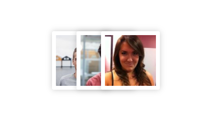

# stacked-avatars
### This component lets you stack images by passing it an array of objects. In it's default style, the component is rendered as


The basic usage of the component is
```jsx
import StackedAvatars from 'stacked-avatars';

const yourList = [
  {
    title: 'Person 1',
    avatarURL: 'https://randomuser.me/api/portraits/men/52.jpg'
  },
  {
    title: 'Person 2',
    avatarURL: 'https://randomuser.me/api/portraits/men/51.jpg'
  },
  {
    title: 'Person 3',
    avatarURL: 'https://randomuser.me/api/portraits/women/1.jpg'
  }
];

return (
  <StackedAvatars
    data={yourList}
    imageKey="avatarURL"
  />
)
```

Note that in the above example, the key is `avatarURL` because the array of objects contains the image under the key `avatarURL`.

### Component Configuration

The following props can be configured for this component

| Prop | Description | Default |
|:--- |:--- |:--- |
| data | Contains the array of objects with each object containing a key, whose value is the imageURL for the stacked avatar | mandatory prop |
| imageKey | This is the property that is present in each object in the data array, whose value is the imageURL for the stacked avatar | mandatory prop |
| maxAvatarCount | Determines how many stacked avatars should be displayed | 3 |
| styles | Let's you pass in your own style object |

### The styles Object

You can customize the following styles of the AvatarContainer(This is the element which is present for each image and contains border, shadow etc)
| Property | Description | Default |
|:--- |:--- |:--- |
| width | width of the element | `32px` |
| height | height of the element | `32px` |
| borderRadius | border-radius of the element | `50%` |
| boxShadow | box-shadow of the element | `0 0 4px rgba(0, 0, 0, 0.5)%` |
| border | border of the element | `2px solid #FFF` |
| marginLeft | `This controls how much should each of the elements in the stack be spaced from each other.` | `50%` |

## Important Note

<b>Setting the marginLeft property will offset the main container. To compensate for this, you can also set the `paddingLeft` property of the container and equate it to the `marginLeft` of the avatarContainer.</b>

### Complete Styles Object Example

```jsx
import StackedAvatars from 'stacked-avatars';

const yourList = [
  {
    title: 'Person 1',
    avatarURL: 'https://randomuser.me/api/portraits/men/52.jpg'
  },
  {
    title: 'Person 2',
    avatarURL: 'https://randomuser.me/api/portraits/men/51.jpg'
  },
  {
    title: 'Person 3',
    avatarURL: 'https://randomuser.me/api/portraits/women/1.jpg'
  }
];

const customStyles = {
  container: {
    paddingLeft: '35px'
  },
  avatarContainer: {
    width: '60px',
    height: '60px',
    marginLeft: '-35px',
    borderRadius: '2px',
    boxShadow: '0 0 6px rgba(0,0,0,0.2)',
    border: '4px solid #FFF'
  },
};

return (
  <StackedAvatars
    data={yourList}
    imageKey="avatarURL"
    styles={customStyles}
  />
);
```

The above example would result in the stacked-avatars looking like


